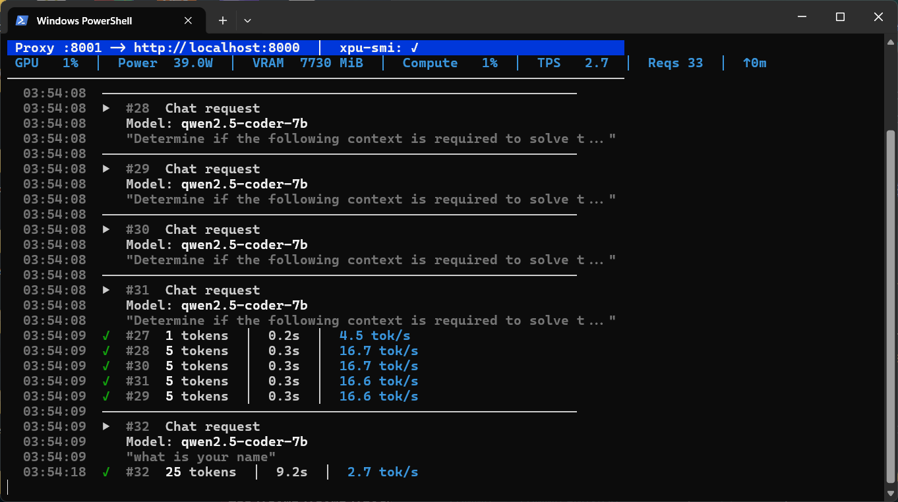

# 🚀 Intel Arc AI Server (Local Inference)

**A high-performance, local AI inference server running directly on Windows 11 using Intel Arc graphics.**

This project sets up [OpenVINO Model Server (OVMS)](https://github.com/openvinotoolkit/model_server) to serve a wide range of efficient **INT4 quantized LLMs** (including Qwen2.5-Coder, Llama, and more) with full XMX hardware acceleration. It provides an OpenAI-compatible API for use with coding agents, IDEs (PhpStorm, VS Code), and custom scripts.



> **👨‍💻 Developer Note**
> This project was born out of a need to bridge the gap between high-performance local hardware (Intel Arc) and the latest AI capabilities. I hope this interface empowers your local AI journey.
>
> Let's connect! You can find me on [LinkedIn](https://www.linkedin.com/in/hanyalsamman/).
---

## ⚡ Quick Start

### 1. New Installation
Run the unified installer to set up everything automatically (Python, Venv, Model, Server):

```powershell
.\install_all.ps1
```

*(This script is idempotent — safe to run on existing installs to verify components)*

### 2. Start the Server (Standard)
For general use (Open Interpreter, Custom Scripts):
```powershell
.\run_server.ps1
```
- **Port:** `8000`
- **Output:** Raw high-performance OVMS stream across `localhost`.

### 3. Start Dynamic Mode (Hot-Swap Ready)
If you want command-based model switching without restarting scripts:
```powershell
.\start_server_dynamic.ps1
```
- Uses `config.json` (`--config_path`) for OVMS model configuration.
- Works with `.\manage_models.ps1 switch ...`.

### 4. Start for IDEs (PhpStorm / VS Code)
If your tool requires strict OpenAI compliance (e.g., specific `id` fields in streams):
```powershell
.\run_ide_proxy.ps1
```
- **Port:** `8001`
- **Output:** Proxied stream with compatibility fixes injected.

### 5. Configuration (Optional)
Customize ports, paths, and model settings by editing `config.env` (created after first run or manually):

```ini
OVMS_PORT=8000           # REST API Port
OVMS_GRPC_PORT=9000      # gRPC Port
PROXY_PORT=8001          # IDE Proxy Port
MODEL_NAME="qwen2.5-coder-7b"
# ... and more
```
**Note:** If you change `config.env`, re-run `.\install_all.ps1` to apply the new settings to the generated launch scripts.

### 6. Changing Models
To switch models easily (e.g., Llama-3, Mistral, Phi-3), use the interactive setup:

https://huggingface.co/collections/OpenVINO/llm

```powershell
.\download_model.ps1 -Setup -PerformanceProfile Balanced

═══════════════════════════════════════════════════════════
  Select Model to Install (INT4 Optimized)
═══════════════════════════════════════════════════════════

[1] Qwen2.5-Coder-7B-Instruct | ~5 GB    | Best for Coding (Default)
[2] Qwen3-8B                  | ~5 GB    | Latest Qwen3, Strong All-Round
[3] Qwen3-4B                  | ~3 GB    | Fast Qwen3, Great Quality/Speed
[4] Qwen3-14B                 | ~8 GB    | Largest Qwen3, Best Quality
[5] DeepSeek-R1-Distill-7B    | ~5 GB    | DeepSeek R1 Reasoning
[6] DeepSeek-R1-Distill-14B   | ~8 GB    | DeepSeek R1 Reasoning, Larger
[7] Phi-4-mini-instruct       | ~5 GB    | Microsoft Phi-4 Mini
[8] Phi-4                     | ~8 GB    | Microsoft Phi-4 Full (14B)
[9] Mixtral-8x7B-Instruct     | ~24 GB   | MoE, Needs CPU offload
[10] Qwen3-1.7B                | ~1.2 GB  | Ultra-Fast Debug & Testing

```
This will display a list of **Top 10 verified INT4 models**, handle the download, and update your configuration automatically.
After changing models:
- Standard mode: run `.\start_server.ps1`
- Dynamic mode: run `.\manage_models.ps1 switch <ModelName>`

### 7. Performance Profiles (graph.pbtxt)
`download_model.ps1` now supports explicit profiles:

```powershell
.\download_model.ps1 -Setup -PerformanceProfile Safe
.\download_model.ps1 -Setup -PerformanceProfile Balanced
.\download_model.ps1 -Setup -PerformanceProfile Fast
```

- `Safe` => `cache_size=2`, `max_num_seqs=2`
- `Balanced` => `cache_size=4`, `max_num_seqs=4` (default)
- `Fast` => `cache_size=8`, `max_num_seqs=8` (may OOM on larger models)

### 8. Command-Based Model Control

```powershell
.\manage_models.ps1 status
.\manage_models.ps1 list
.\manage_models.ps1 switch Qwen3-4B
.\manage_models.ps1 rollback
```

---

## 📚 Documentation

| File | Description |
|---|---|
| **[INSTALL.md](INSTALL.md)** | Detailed manual installation guide and architecture overview. |
| **[CONNECT_TOOLS.md](CONNECT_TOOLS.md)** | How to connect VS Code (Cline/Continue), Open Interpreter, and Python scripts. |
| **[gpu_checklist.md](gpu_checklist.md)** | Verification steps for Intel Arc drivers, ReBAR, and XMX usage. |
| **[oom_troubleshooting.md](oom_troubleshooting.md)** | Solving "Out of Memory" errors and WDDM spilling issues. |

---

## 🧩 Scripts Overview

- **`install_all.ps1`**: The "One Script to Rule Them All". Checks prerequisites (OS, GPU) and installs the stack.
- **`run_server.ps1`**: User-friendly launcher for the main server.
- **`start_server_dynamic.ps1`**: Dynamic OVMS launcher (`--config_path`) for hot-swapping.
- **`run_ide_proxy.ps1`**: Launcher for the compatibility proxy.
- **`manage_models.ps1`**: Command-based model switch/status/rollback.
- **`verify_environment.ps1`**: Deep diagnostic tool for debugging environment issues.
- **`setup_ovms.ps1`**: Helper to download/refresh the OVMS binary.
- **`download_model.ps1`**: Helper to download INT4 models and generate `graph.pbtxt` with profile-based limits.

---

## ⚙️ Technical Specs

- **Model:** Qwen2.5-Coder-7B-Instruct (INT4 OpenVINO IR)
- **VRAM Usage:** ~5.5 - 7.5 GB (Fits comfortably in 8GB w/ `u8` cache precision)
- **Context Window:** 32k (Limited to ~4k-8k purely in VRAM)
- **Backend:** OpenVINO 2025.4 + MediaPipe LLM Calculator
- **Acceleration:** Intel XMX (Matrix Engines) via Level Zero

---

*Verified on Windows 11 Build 26200 + Intel Driver 32.0.101.8425*
